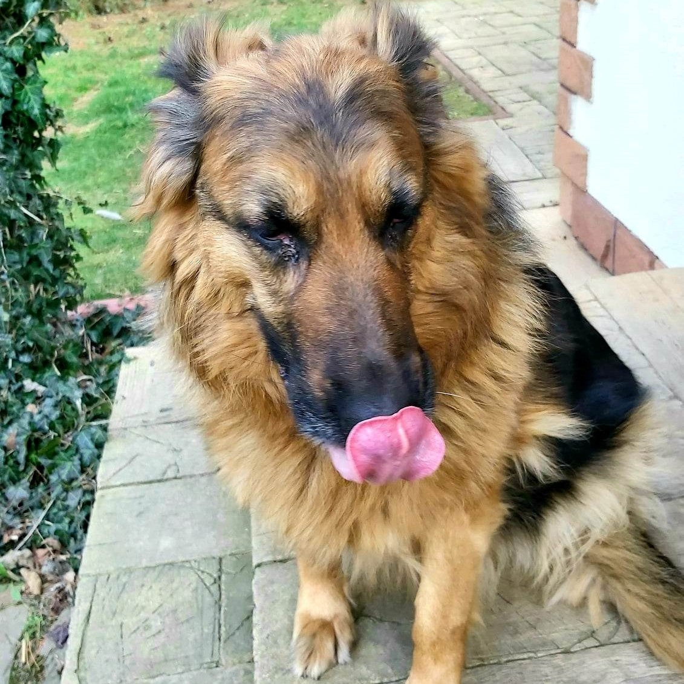

***

### ___Welcome to my personal website.  Don't worry, it's just temporary :)___ 

***

## **Something about me**

* just an ordinary hardworking student at AGH University of Science and Technology
* passionate musician
* loves to cook
* IT and AI pro in the making
* still learning how to code properly

 

## **Visit my GitHub profile here**

> [maadZia's GitHub](https://github.com/maadZia)

 

## **My projects**

***

Have you ever heard of group called [_PRE-ENGINEERS_](https://github.com/AGH-Narzedzia-Informatyczne-2022-2023/PRE-ENGINEERS/wiki)?

If not, no worries, because you certainly will soon! 

***
I am currently working with five amazing people on new app called StydUnity. The main objective of our project is to create an inimitable and user-friendly community that will support students all across the country. We desire to create a safe space where our beloved peers could exchange notes or knowledge of various kind to help each other survive those sometimes extremely difficult years.

To learn more about our ideas, click here >> [StudUnity](https://github.com/AGH-Narzedzia-Informatyczne-2022-2023/PRE-ENGINEERS/blob/a833c60f0b3ce092d784c809d93563dadcd24990/README.md)

***

 
 

### **here's my cute dog to make your day**

***

***
